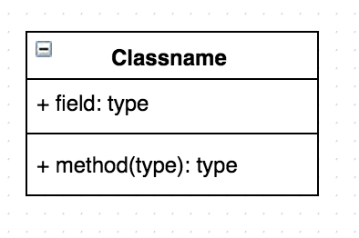
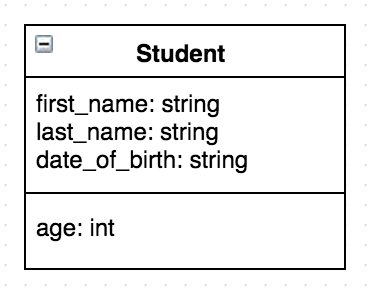
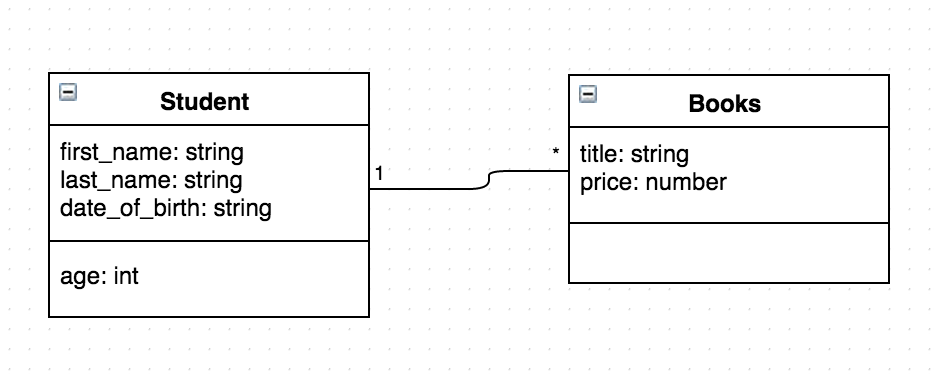
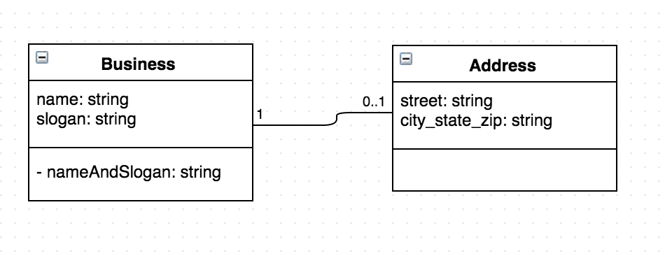

# Domain Modeling

Being a fullstack developer requires you to be able to turn words into software.  Often times the words you get are in the form of user stories, and there's a big chasm between user stories and lines of code.  When turning words into software, you are "modeling" the domain, it's often useful to draw the entities, attributes and relationships visually.

## Objectives

By the end of this lesson you should be able to:

- Draw a UML Class Diagram from instructions
- Draw a UML Class Diagram from code
- Write code from a UML Class Diagram
- Describe the cardinality of a relationship (you don't have to memorize all the cardinalities right now)

## Don't sweat the details

People have developed several ways of drawing models for code.  In this lesson you'll be exposed to Class Diagrams (a part of [UML](https://en.wikipedia.org/wiki/Unified_Modeling_Language)).  In the next lesson, you'll be introduced to Entity Relationship Diagrams, and there are two kinds of those.  Often times seasoned developers mix all of them up - and nobody

Learning the fine details of the UML spec is unnecessary, because you are unlikely to find any fullstack developers in the industry that know the spec in a very detailed way.  And that's OK, because even with a basic sense of how to draw and read them, you can solve most of your team's communication problems.

## Setting the stage

Learning class diagrams is important for many reasons.  First, they help you break down problems by being able to draw the model before writing code.  They also help you get up to speed quickly on large code bases with large object models.  Finally, they will help you in many technical interviews when asked to model a domain.

The "what" of this exercise is that you'll read a bunch, write some diagrams and write some code.  So close everything down before starting - you'll have several Chrome tabs open.

## Class Diagrams

The core of an Class Diagram is a Class, which looks like this:



Classes are blueprints for instances.  Instances have both state (attributes, aka properties), and behavior (methods aka functions).  Class diagrams describe exactly which attributes and methods an instance of that class will have.

For example, imagine you are modeling a Student.  The class diagram for that student might look like this:



In ES5 JavaScript, if you were to implement this class, it might look something like:

```js
var Student = function (firstName, lastName, dateOfBirth) {
  this.firstName = firstName
  this.lastName = lastName
  this.dateOfBirth = dateOfBirth
}

Student.prototype.age = function () {
  // calculate age here...
}

var joe = new Student('Joe', 'Jo', '12/12/1983')
var sue = new Student('Sue', 'Su', '11/11/1987')
```

Look back at the diagram.  Notice the 3 main parts.

- The **class name** (Student) is at the top
- The **attributes** (`first_name`, `last_name`, `date_of_birth`) are in the middle
- The **methods** (`age`) are at the bottom

> _Astute Student_:  **BUT WAIT!**  The Class Diagram shows snake case (`first_name`) and the JavaScript code has camelCase (`firstName`).  Shouldn't some UML stickler be turning over in their grave?

---

> _Seasoned Developer_: The short answer is that these diagrams represent the _concept_ of a Student.  They don't have to match any particular language's capitalization norms.  But some people _really_ care about it, so be nice to them when you encounter them in the wild.  They probably don't have a lot of friends.  Standing at the whiteboard in the industry, it doesn't matter much.

There's one final part of these diagrams - **relationships**.  Relationships are defined by drawing lines between Classes, like so:



If you were to implement this in JavaScript, it might look like this:

```js
var Student = function (firstName, lastName, dateOfBirth) {
  this.firstName = firstName
  this.lastName = lastName
  this.dateOfBirth = dateOfBirth
  this.books = []
}

Student.prototype.age = function () {
  // calculate age here...
}

var Book = function (title, price) {
  this.title = title
  this.price = price
}

var joe = new Student('Joe', 'Jo', '12/12/1973')
joe.books.push(new Book('Cracking the Coding Interview', 12.99))
```

> Astute Student:  **BUT WAIT!**  The student class has a `books` attribute, but it's not on the diagram!  

---

> Seasoned Developer: Yeah, yeah - I know.  You have two choices when you model relationships - you can include the attribute (in this case `books`) or leave it out.  If you leave it out, you must _assume_ that the code will have that attribute with the correct pluralization.  There's probably an academic answer to what's "correct" in the UML spec, but in the industry, few people care.

**Read up on relationships**

First, visit [http://www.smartdraw.com/class-diagram/](http://www.smartdraw.com/class-diagram/) and specifically read the "Multiplicity (Cardinality)" section to see one explanation of how to draw relationships.

Then go to  [http://www.agilemodeling.com/artifacts/classDiagram.htm](http://www.agilemodeling.com/artifacts/classDiagram.htm) and read "Table 1. Multiplicity Indicators."

## Exercise

OK - you are ready for some code.  Visit [https://www.draw.io/](https://www.draw.io/) and start a new diagram.

**#1 - Words => Diagram**

Draw a Class named "Geek" with the attributes "name" and the method "buy(device)" and "latest".

Draw a Class named "Device" with the attributes "make", "model", "year", "price".

Draw a relationship such that a Geek can have many Devices.

Questions:

- How would you draw a Class that has no methods?
* Both attributes and methods are optional, so I believe you could just leave the third row out. 
- Do you need to add a property for `devices` on `Geek`?  Why or why not?
* You could add a property for devices... but it is not necessary because the buy(device) method will ultimately or at least could.. add
 that device property for you. More thank likely it would create a new sub-class or array in that position.

When you think you are done, double check that your diagram looks like [this](images/geek-devices.png).

**#2 - Code => Diagram**

Draw a diagram that represents this code:

```js
var Deck = function () {
  this.cards = []
}

Deck.prototype.addCard = function (card) {
  this.cards.push(card)
};

var Card = function (suit, cardNumber) {
  this.suit = suit
  this.cardNumber = cardNumber
  this.faceUp = false
}

Card.prototype.flip = function () {
  this.faceUp = !this.faceUp
};
```

To tackle this problem, find the "Classes".  While JavaScript doesn't have Classes in ES5, the convention is that class-like functions start with an uppercase letter.  There are two "Classes" in the code above.

Next, look for attributes.  In JavaScript, attributes are implemented as properties.  So look for the properties on each "Class".

Finally, look for relationships.  In often times the relationships are just properties that match the name of another class (sometimes singular, sometimes plural).

Read over previous examples, take some time and draw it until you think you've gotten it right.  Now check your answer against [this](images/deck-card.png).

**#2 - Diagram => Code**

Write JavaScript to match the following Class Diagram:



Pay careful attention to the _cardinality_ of the relationships.  How many addresses does a business have?

When you think you've gotten it - check [here](business-address.js) to see our solution.

Question:

- If the relationship had been "1________1", how would you have changed the code?

## Reflect - Self Assess

Go through the Objectives above.  For each one, how do you think you did?

If you didn't do well on any of them, search Google Images for "UML Class Diagram" and try writing code that implements the diagrams.  Also search through any code in `node_modules` in any Express app, look for constructor functions, and try to model them.

## Reflect - New Questions

What new questions do you have now that you've seen these?  Write down 4:

1. __
1. __
1. __
1. __
