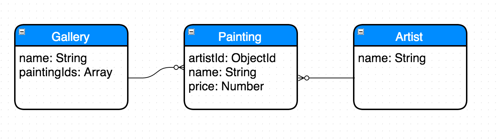

# Entity Relationship Diagrams

## Objectives

By the end of this lesson you should be able to:

- Describe the differences between Class Diagrams and Entity Relationship Diagrams
- Write Mongo collections / documents to match Entity Relationship Diagrams
- Write Entity Relationship Diagrams to match existing Mongo collections / documents

## Set the stage

Class Diagrams are used to communicate about _code_ (classes, instances) whereas ERDs are used to communicate about _database design_ (tables / columns, collections / document properties).  See the difference?

The key is that you can quickly read and produce both, so that whichever model you are looking at / working with is useful to you as a developer.

See the exercise below for the "what" - you'll be watching some videos, reading, writing some Mongo commands and drawing some diagrams.

1. Start a new [https://draw.io/](https://draw.io/) drawing, and close out any Chrome tabs / terminal windows you had from before.
1. Make sure you have `mongo` running

## A close cousin

Entity Relationship Diagrams and Class Diagrams are very, very closely related.  There are a few small differences, which in practice actually get mixed up _all_ the time (OK - maybe not _all_ the time, but like, 90+% of the time).

To start, go watch this video on 1.5x or 2x - [https://www.youtube.com/watch?v=-fQ-bRllhXc](https://www.youtube.com/watch?v=-fQ-bRllhXc).  They use some language in their like "primary key" and "foreign key" that doesn't necessarily relate to Mongo, but it's useful to be exposed to.

Now read up on cardinality at [https://en.wikipedia.org/wiki/Entity%E2%80%93relationship_model](https://en.wikipedia.org/wiki/Entity%E2%80%93relationship_model) and in particular, focus on the Crow's Foot notation.  This is one of the more common notations used when writing things quickly on a whiteboard.

When you are done with that - peruse the following docs.  Don't read every word deeply, but get the general gist of what they are saying:

- http://searchcrm.techtarget.com/definition/entity-relationship-diagram
- http://www.smartdraw.com/entity-relationship-diagram/
- http://www.smartdraw.com/uml-diagram/

## What's different?

What differences can you spot between ERD and Class Diagrams?  There aren't too many.  Here are [a few visual differences](class-diagram-erd-differences.md) to note.

At at high level, ERDs use the word "Entity" instead of "Class".  In Mongo, Entities map to Collections.

Another main difference is that in Mongo, you can't store one document "in" another one.  Instead you have to reference other documents by their `_id`s (sometimes arrays of ids).

## Exercise

**#1 - Words => Diagram**

Draw a diagram that has 4 Entities: Survey, Question and Answer and User.

- Surveys have the Attributes of "name", "published" (boolean) and "endsOn" (date)
- Questions have the Attributes "surveyId" (objectId), "question", "correctAnswer"
- Answers have the Attributes "userId", "questionId" and "answer"
- Users have the Attribute "name"

Draw relationships (using crow's feet) such that:

- Surveys have many questions
- Questions have many answers
- Answers belong to users and questions

There's an interesting Mongo design problem here - where Questions have many Answers, and Answers belong to Questions.  There are a few ways you can model this in Mongo.  For example you could have:

```js
Question: {
  _id: 8976543,
  answerIds: [12435,7654,13242,654]
}
```

Or you could have:

```js
Answer: {
  _id: 8976543,
  questionId: [12435]
}
```

Or maybe both.  To be explicit (and unlike Class Diagrams), go back to your diagram and specifically add in the property or properties that would make these relationships happen.

See the following docs for more information:

- http://docs.mongodb.org/manual/tutorial/model-embedded-one-to-many-relationships-between-documents/
- http://docs.mongodb.org/manual/tutorial/model-referenced-one-to-many-relationships-between-documents/

---

**#2 - Mongo => Diagram**

Run `mongo < seed.sh` - this will create a database named `erd-examples`.

Then go into the Mongo shell with `mongo erd-examples`.  Use `show collections` and find all documents in all collections, then draw an ERD diagram from the collections / documents you see.

How will you represent each collection?  A new **Entity**.

How will you represent the properties in each document?  As **Attributes** of the **Entity**.

How do you represent each row of data?

Your document should look something like [this](images/courses-games-players.png).

NOTE: typically Collection / Table names are plural in modern Express and Rails databases, because they represent _all_ of the individual documents.  Sometimes you'll see the Entity plural, sometimes singular.  Not a big deal either way - just be consistent within each app and each diagram that you draw.

---

**#3 - Diagram => Mongo**

Take a look at `seed.sh` to see how it's written.  Take a look at how it was run above.

Now write your own Mongo shell script named `galleries.sh` and write the Mongo commands necessary to create a database that has Collections and Documents that match the following ERD:



You'll need to use some Mongo Arrays.  If you don't know how to do that, where would you look first?

## Reflect: Self-Assess

Look at the objectives above.  How'd you do?  Do you think you have any gaps?  Still confused about something?

There's no rush - take your time and review / ask your peers / build sample apps / Google around.  It's important to get this stuff.

## Reflect: New Questions

What new questions do you have?  Write 4 of them down here:

1. _
1. _
1. _
1. _
