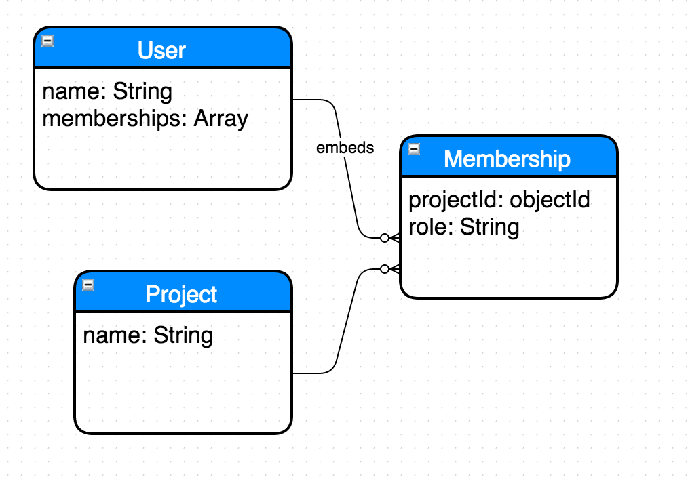

# Modeling Embedded Documents w/ Mongo

## Objectives

By the end of this lesson you should be able to:

- Describe the difference between referencing documents in Mongo and embedding documents
- Describe the pros and cons of embedding documents vs referencing documents
- Model embedded documents with ERD

## Exercise

First, pretty much just read these straight from the docs:

- http://docs.mongodb.org/manual/tutorial/model-embedded-one-to-one-relationships-between-documents/
- http://docs.mongodb.org/manual/tutorial/model-embedded-one-to-many-relationships-between-documents/
- http://docs.mongodb.org/manual/tutorial/model-referenced-one-to-many-relationships-between-documents/

UML and ERD were created long before document databases were a thing.  When using traditional SQL databases, each Entity in an ERD directly mapped to a table, and each attribute directly mapped to a column.  With document databases, things get a little more complex.

You can either embed documents, or reference them.  But how do you reference that on an ERD?  Here's one option:

Another option is to just write out the JSON, like they do in the Mongo docs.  This can be a little cumbersome at a whiteboard, or when making a quick sketch, and doesn't play well with existing modeling tools.  So play with it, and come up with something that works for you.

## Reflect: Self-assess

How'd you do on those objectives?

## Reflect: New questions

What are some new questions you have after going through that?  Add two here:

1. _
1. _
