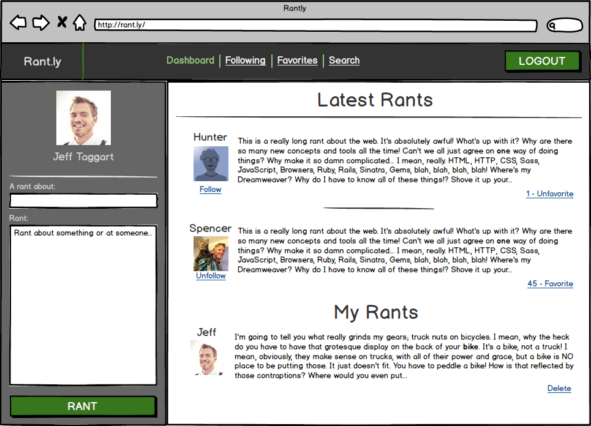
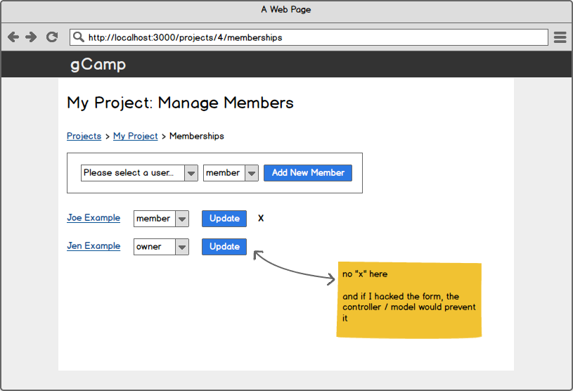

# Entity Relationship Diagrams

## Objectives

By the end of this lesson you should be able to:

- Generate diagrams from stories
- Generate diagrams from wireframes
- Propose more than one model for a given set of nouns (deciding between Entities / Attributes / Relationships etc...)

## Setting the stage

Being a fullstack developer requires you to be able to turn words into software.  Often times the words you get are in the form of user stories, and there's a big chasm between user stories and lines of code.  When turning words into software, you are "modeling" the domain, it's often useful to first draw out the model before writing code.

- Create a new diagram in [https://draw.io/](https://draw.io/)
- Close any previous Chrome Tabs / Terminal windows

This is an art, not a science.  There are many times more than one "right" answer.  Solutions can be wrong, in that they aren't modeled in such a way that you could satisfy the user stories, but once the model supports the stories, it's just a set of tradeoffs, and the art lies in quickly assessing the tradeoffs and picking the one best-suited to your app.

## All the nouns

The first thing to do when looking at a story is to pull out the nouns.  For example, take the following story:

> Users can add photos to events

Just looking at the nouns you see "user", "photo" and "event".  At first glance, you probably want to start by drawing three Entities (or Classes, depending on the type of diagram) - User, Photo and Event.

Further, you see that there's a relationship between Event and Photos - Events _have many_ photos.  So you would also draw that relationship.

Sometimes the distinction between an **Entity** and an **Attribute** are not clear, and you have to weigh the pros and cons.  For example, take this story:

> Users can add an address to a business

Should `address` be an attribute on `Business`?  Or should it be its own Entity?  What are the pros and cons to each?  in Mongo, you have 3 options for modeling this - what are they?

1. _
1. _
1. _

For you language nerds, see "Mapping natural language" on [https://en.wikipedia.org/wiki/Entity%E2%80%93relationship_model](https://en.wikipedia.org/wiki/Entity%E2%80%93relationship_model) for some guidance on how to more quickly map well-written English sentences to a model.

## Sometimes the nouns are unspoken

Take the following stories:

> Users can add users as members of projects

---

> Users can add users as admins of projects

The Naive approach would be to just take the nouns and create a model that has:

- User
- Project
- Member (userId, projectId)
- Admin (userId, projectId)

Hmmm.   Take a look at Member and Project.  They both have identical attributes - userId and projectId.  You could combine those into a single Entity that had:

- userId
- projectId
- role ("admin" or "user")

But what would you call it?  "Membership" is a great name for that object.  But note that it was never mentioned in the stories.  In many cases, the "many-to-many" relationships are the ones that don't have nouns that appear in user stories - you have to derive them yourself.

## Some of the verbs

Verbs generally map to **Methods** in Class Diagrams.  There's no equivalient to methods in ERD - so if you are doing ERD, you just leave those out.  For example take the following story:

> Users can filter the members of projects

In a class diagram, there may be a `filteredMembers` method on the `Project` Class, but in ERD you'd just leave this out.

## Exercise

**#1: Stories => Models**

> **NOTE**: For this exercise, use ERD, Class Diagrams or any hybrid thereof.  For example, you could use a Class Diagram but use Crow's feet for relationships - it's all good!  Very, very few fullstack developers in the industry know what the fuck the academically correct way is to write these diagrams (including most of your instructors) - but they should all be able to generate _something_ readable, and read diagrams in any style.

You're helping build the next big real estate application. You and your team are all set to disrupt the market if you can successfully model your domain and release your software.

You are handed several user stories. Before you get started, you decide to sit down and model out the domain to support these crazy requirements.

As you go through each story, build up the model that you think will satisfy the story. Each addition must not "break" previous requirements.

* As a Real Estate Agent, when I register then I can log in.
* As a Real Estate Agent, I can add a house listing.
* As a Real Estate Agent, I can view all of my listings.
* As a Potential Buyer, I can select a primary Real Estate Agent, which I can only have one of.
* As a Real Estate Agent, I can create an office with an address.
* As a Real Estate Agent, I can add other Real Estate Agents to my office.
* As a Real Estate Agent, I can belong to more than one office.
* As a Potential Buyer, I can view house listings.
* As a Potential Buyer, I can mark that I'm interested in a listing.
* As a Potential Buyer, I can view all listings I'm interested in.

Take some time to make sure you feel like it's right.

Then take a look at [this sample model](images/listings.png)

**#2: Wireframes => Models**

Often times you have to take designs or wireframes and turn them into working code.  Doing so requires you to look at every wireframe carefully and identify each component.  Take the following wireframe:

Take a moment to look very carefully at each part of the page.  Try to build a model from what you see.  Really take a few minutes - don't rush or look ahead.

Ready?  Have your own model now?...

OK - notice that you see a user profile pic and a "logout" button.  This implies something like:

- User
  - name
  - profileImageUrl
  - password

Next, notice the "Latest Rants".  And also notice that there are two Rants at the top of the page.  Each Rant has a User associated with it on the screen, and has a title and a body.  This implies at least:

- Rant
  - userId
  - subject
  - body
  - createdAt (because otherwise how would we know it was "recent"?)

Notice that under each user there is a "follow" link.  How would you model that?  It might look something like:

- User
  - other fields...
  - follows: Array of ids

Or it might imply:

- Followship
  - userId
  - followerId

But the concept of any user being able to follow multiple other users _must_ be in your model _somehow_.

Finally, notice that you can "favorite" a Rant.  This implies something like:

- FavoritedRant
  - userId
  - rantId

Or maybe:

- User
  - other fields...
  - favoritedRantIds: Array of Rant ids

OK - now your turn.  Take the following wireframe and create a new model of it:

Here's [one example](images/membership.png) of how you could do it.

## Reflect: Self-assess

How'd you do with those stories?  Having gone through that, did you meet the objectives?

If not, find someone who has gotten past this, and ask them to generate user stories for you.

## Reflect: New Questions

What new questions do you have now?  List 4 here:

1. _
1. _
1. _
1. _
